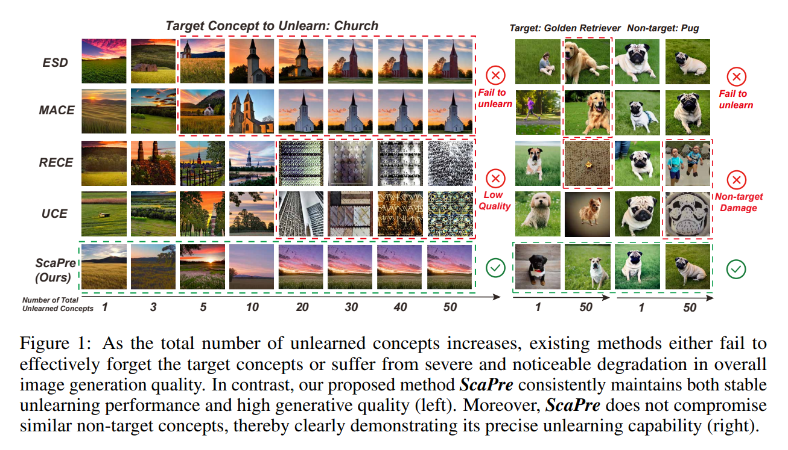
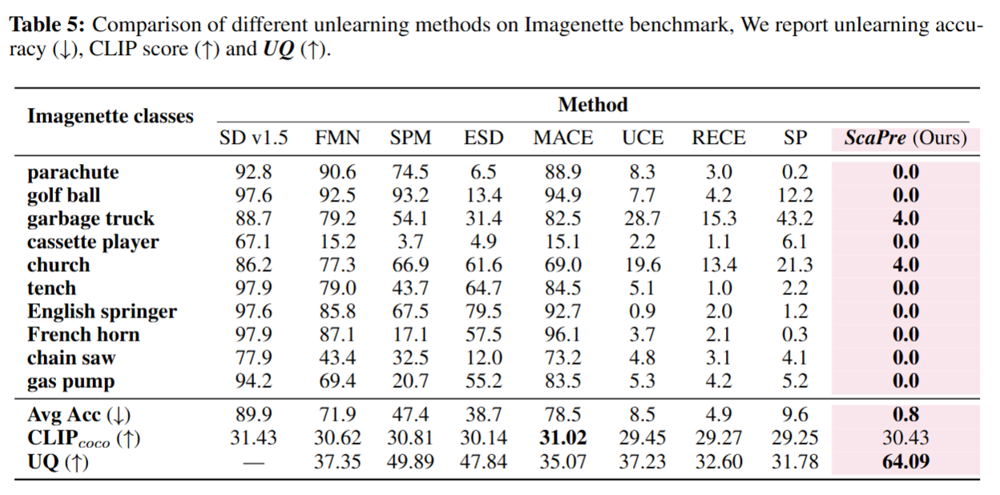

# [ICLR 2026] Forget Many, Forget Right: Scalable and Precise Concept Unlearning in Diffusion Models

<p align="center">
  <a href="https://arxiv.org/abs/2601.06162"></a>
  <a href="#"></a>
  <a href="#"></a>
</p>

> **Forget Many, Forget Right: Scalable and Precise Concept Unlearning in Diffusion Models**
>
> [Kaiyuan Deng](mailto:kaiyuan0415@arizona.edu)<sup>1</sup>, Gen Li<sup>2</sup>, Yang Xiao<sup>3</sup>, Bo Hui<sup>3</sup>, Xiaolong Ma<sup>1</sup>
>
> <sup>1</sup>The University of Arizona, <sup>2</sup>Clemson University, <sup>3</sup>The University of Tulsa

---

## Introduction

Existing multi-concept unlearning methods in t2i diffusion models face three critical challenges when scaling up: **(i)** conflicting weight updates that degrade generative quality, **(ii)** imprecise unlearning that damages similar non-target concepts, and **(iii)** reliance on extra data or auxiliary modules that bottleneck scalability. We propose **ScaPre**, a unified closed-form framework that addresses all three issues simultaneously. ScaPre introduces a **conflict-aware stable design** (spectral trace regularizer + geometry alignment) to stabilize optimization, and an **Informax Decoupler** to confine updates to concept-relevant subspaces. It requires no additional data or sub-models, completing unlearning of 50 concepts in only **120 seconds**, and can forget up to **×5 more concepts** than the best baseline within acceptable generative quality.

<p align="center">
  
</p>
<p align="center"><em>As the number of unlearned concepts increases, existing methods either fail to forget or suffer severe quality degradation. ScaPre maintains both stable unlearning and high generative quality.</em></p>

<p align="center">
  
</p>
<p align="center"><em>Quantitative comparison on the Imagenette benchmark (10 classes). ScaPre achieves the lowest forgetting accuracy (0.8%) while maintaining competitive generation quality (UQ = 64.09).</em></p>

---

## Installation

### Prerequisites

- [Anaconda](https://www.anaconda.com/download) 
- NVIDIA GPU with CUDA 12.4 (or above) support

### Setup

```bash
# Clone the repository
git clone https://github.com/kaiyuan02415/ScaPre.git
cd ScaPre

# Create conda environment
conda create -n scapre python=3.10 -y
conda activate scapre

# Install PyTorch (CUDA 12.4)
pip install torch==2.6.0 torchvision==0.21.0 --index-url https://download.pytorch.org/whl/cu124

# Install remaining dependencies
pip install -r requirements.txt
```

### Verify

```bash
python -c "import torch; print(f'PyTorch {torch.__version__}, CUDA: {torch.cuda.is_available()}')"
```
---

## Usage

### Concept Erasing

**Object Unlearning (Imagenette)**

```bash
python edit/erase.py \
    --concepts "parachute, golf ball, garbage truck, cassette player, church, tench, \
    english springer, french horn, chain saw, gas pump" \
    --concept_type object \
    --device 0 \
    --base 1.5 \
    --p 2 \
    --alpha_min 0.8 \
    --entropy_samples 20
```

**Large-Scale Object / Style Unlearning**

```bash
python edit/erase_scale.py \
    --concepts "artist1, artist2, ..." \
    --concept_type object \
    --device 0 \
    --base 1.5 \
    --use_mi_softmask \
    --erase_scale 2 \
    --p 8 \
    --bures_iters 1 \
    --enable_ased \
    --entropy_samples 30 \
    --entropy_bins 20
```

**Explicit (NSFW) Content Unlearning**

```bash
python edit/erase_scale.py \
    --concepts "nudity,nude,naked,..." \
    --concept_type unsafe \
    --device 0 \
    --base 1.5 \
    --erase_scale 2 \
    --p 3 \
    --bures_mu_from_entropy \
    --bures_iters 1
```

### Evaluation

**Object Erasure Evaluation**

```bash
python eval/benchmarking/object_erase.py \
    --target "your_target" \
    --baseline concept-prune \
    --removal_mode erase \
    --ckpt_name "your_saved_checkpoint.pt"
```

**Nudity / Explicit Content Evaluation**

```bash
python eval/benchmarking/nudity_eval.py \
    --ckpt_name your_saved_checkpoint.pt \
    --eval_dataset i2p \
    --output_dir results/nudity_eval
```

**Artistic Style Evaluation**

```bash
python eval/benchmarking/artist_erasure.py \
    --ckpt_name your_saved_checkpoint.pt \
    --target "your_target" \
    --output_dir results/artist_eval
```

**COCO CLIP Score (Generative Quality)**

```bash
python eval/benchmarking/eval_coco_clip.py \
    --prompt_file "datasets/coco_prompts.txt" \
    --ckpt_name "your_saved_checkpoint.pt" \
    --model_id "runwayml/stable-diffusion-v1-5" \
    --target "your_target"
```

---

## Citation

If you find this work useful, please cite our paper:

```bibtex
@article{deng2026forget,
  title={Forget Many, Forget Right: Scalable and Precise Concept Unlearning in Diffusion Models},
  author={Deng, Kaiyuan and Li, Gen and Xiao, Yang and Hui, Bo and Ma, Xiaolong},
  journal={arXiv preprint arXiv:2601.06162},
  year={2026}
}
```

---

## Acknowledgements

We thank the authors of [ESD](https://github.com/rohitgandikota/erasing), [UCE](https://github.com/rohitgandikota/unified-concept-editing), [MACE](https://github.com/Shilin-LU/MACE), [RECE](https://github.com/CharlesGong12/RECE), [SPM](https://github.com/Con6924/SPM), [FMN](https://github.com/SHI-Labs/Forget-Me-Not), and [SP](https://github.com/coulsonlee/Sculpting-Memory-ICCV-2025) for releasing their code.
